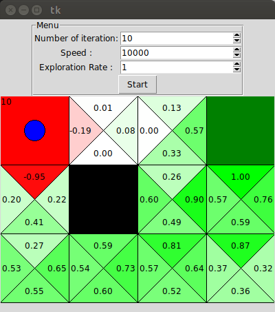

# q-learning

A small app that simulate a bot finding it's path on a map using q-learning.

## Goals:
I made this game to test my understanding of Q-Learning. As a side effect it allowed me to learn how to do GUI in tkinter. I made it quickly, so there's a lot to improve.

## Launch and Installation:
```bash
python3 main.py
```
If you encounter an error regarding tkinter, you might have to install it. On
Ubuntu:
```bash
sudo apt install python-tk python-imaging-tk python3-tk
```

## Usage:
You will be asked to choose a map file at launch, chose the defaults one or the one you made. Then you can tinker with the parameter (I recommend to launch with an high exploration rate - 0.5/0.8 - to find new paths).

### Creating maps:
You can create new maps by creating a file with the `.map` extension and fill it this way:
* `0` is a blank tile
* `1` is a reward tile
* `2` is a penalty tile
* `X` is an innacessible tile.
A line in the file correspond to a line in the app. Currently the starting point can only be at (0, 2).

## TODO:
Lots of things to do:
* refactor the code. It's awful currently
* Allow the user to modify the learning rate or the gamma value.
* Allow the user to move the dot
* Open the map in the windows, not only at launch.
* A mode to display the path with arrow pointing towards the best action.
* The formula I found favor the propagation of "good" path, and doesn't propagate the "bad" one at all. I'm not sure it's optimal as the AI will keep going on the bad path even if it got a lot of bad reward there. Maybe I should modify it to propagate the most extreme action instead of the one that bring the most value ...? 
